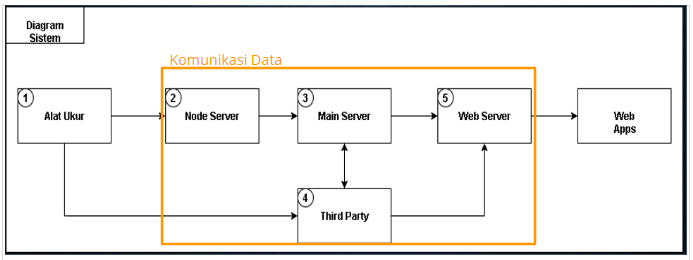

# Komunikasi
Sebuah sistem komunikasi yang digunakan untuk mengirim data dari sistem akuisisi data ke website BEMS.

## Diagram Blok Sistem


komunikasi data berlangsung antara node server, main server, dan web server, serta mempergunakan jasa third party. 

## Clone Repository
Untuk mengakses dan menjalankan program, lakukan perintah `git clone`
```
git clone https://github.com/drfauziah/komunikasi.git
cd komunikasi
```
## Running
Untuk percobaan, data yang didapat dari alat ukur berupa data random. Komunikasi data berlangsung dari node server ke main server.
```
python "Updated 2 11 2019. Generate Random Value to DB.py"
```

Untuk mengirim data dari main server ke web server, dengan syarat `ip my public` diijinkan oleh admin web server.
```
python "Updated 5 11 2019. Upload via Local.py"
```
